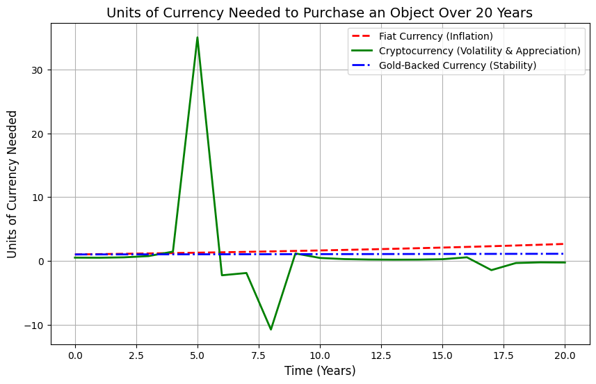

# Currency Comparison Over 20 Years

## Project Overview

This project models the number of currency units required to purchase a stable object (one with an intrinsic value that doesn't change over time) over a 20-year period. We compare three types of currencies:

1. Fiat Currency (e.g., USD, EUR): Subject to inflation over time.
2. Cryptocurrency (e.g., Bitcoin, Ethereum): Assumed to be volatile but generally appreciating over time.
3. Gold-Backed Currency: Assumed to be relatively stable with low inflation.

The project is visualized using Matplotlib and NumPy to show how the purchasing power of each currency evolves over time.

## Graph Breakdown

- Fiat Currency: In this simulation, fiat currency follows an annual inflation rate of 5%, which can be adjusted for different scenarios. Over time, you will need more fiat currency to buy the same object due to inflation.
  
- Cryptocurrency: Cryptocurrency values are modeled with volatility (using a sine wave for short-term fluctuations) and general appreciation over time. Fewer units of cryptocurrency are needed as time passes due to its potential appreciation.
  
- Gold-Backed Currency: Assumed to have low inflation (0.5% per year), the gold-backed currency remains a stable store of value. The increase in units required to buy the object is minimal compared to fiat.

